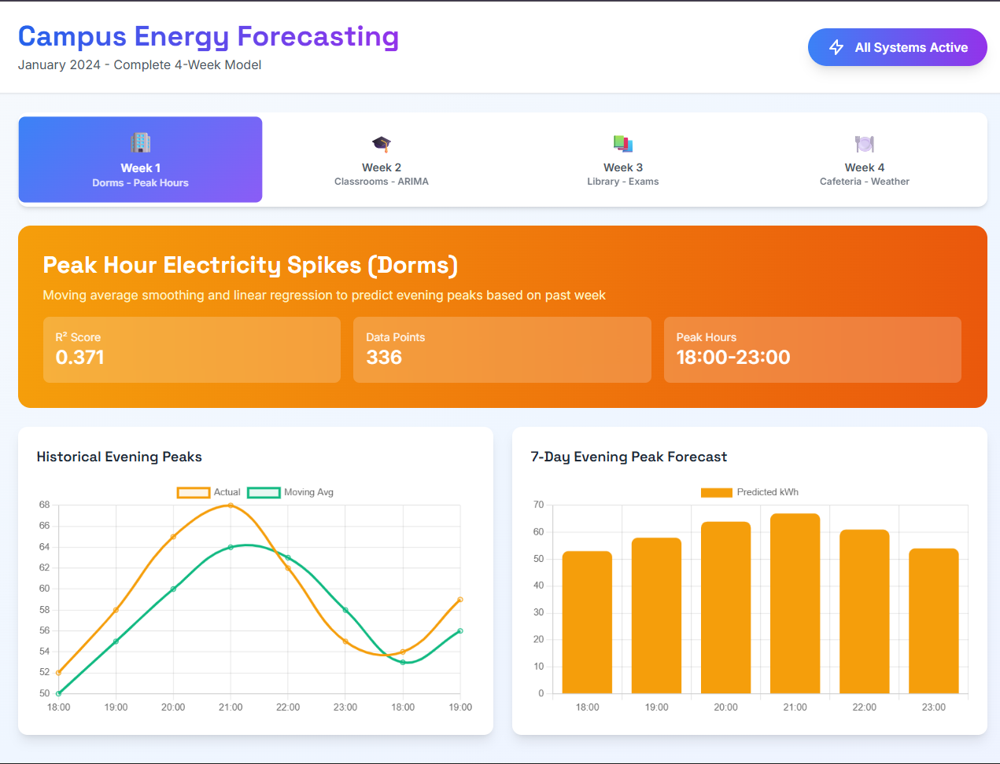
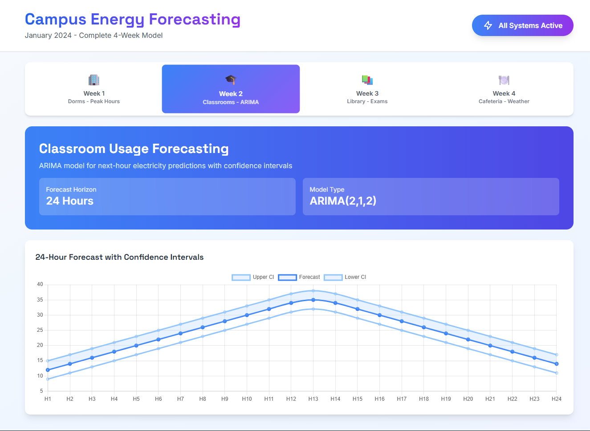
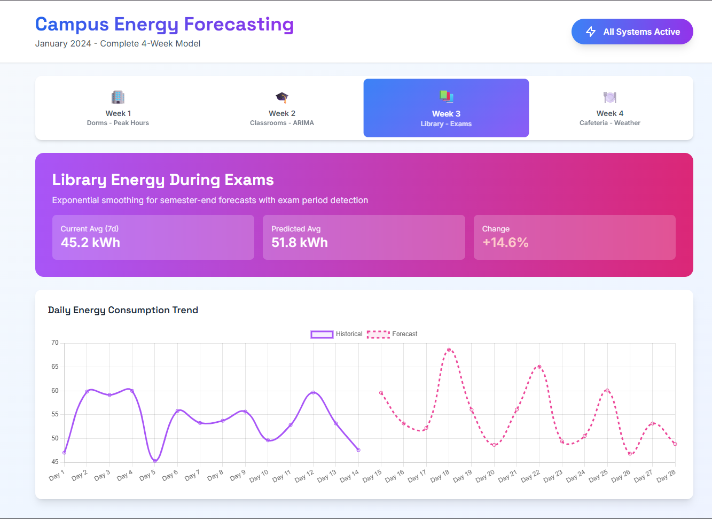
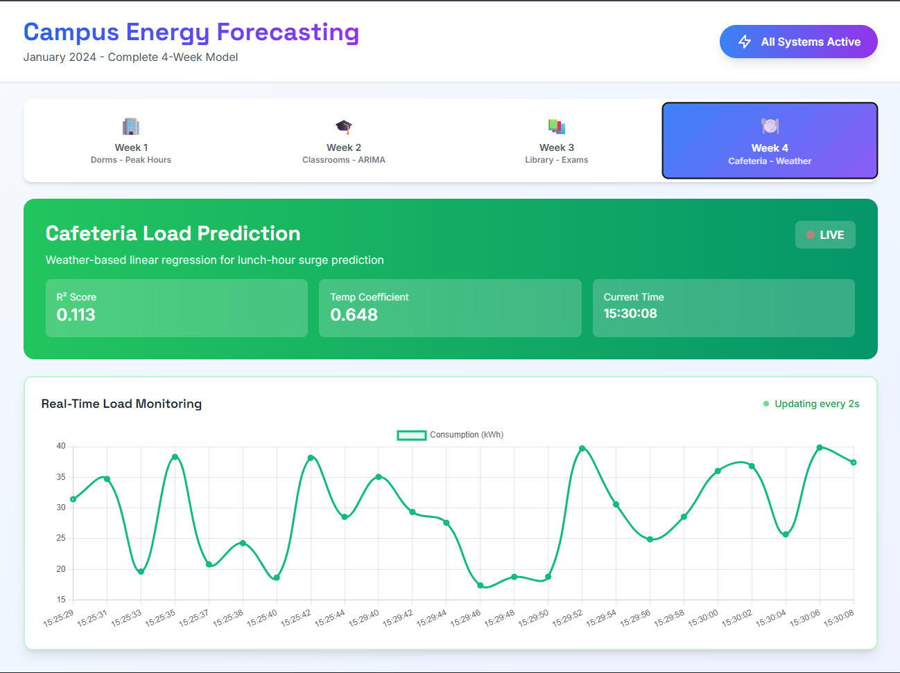
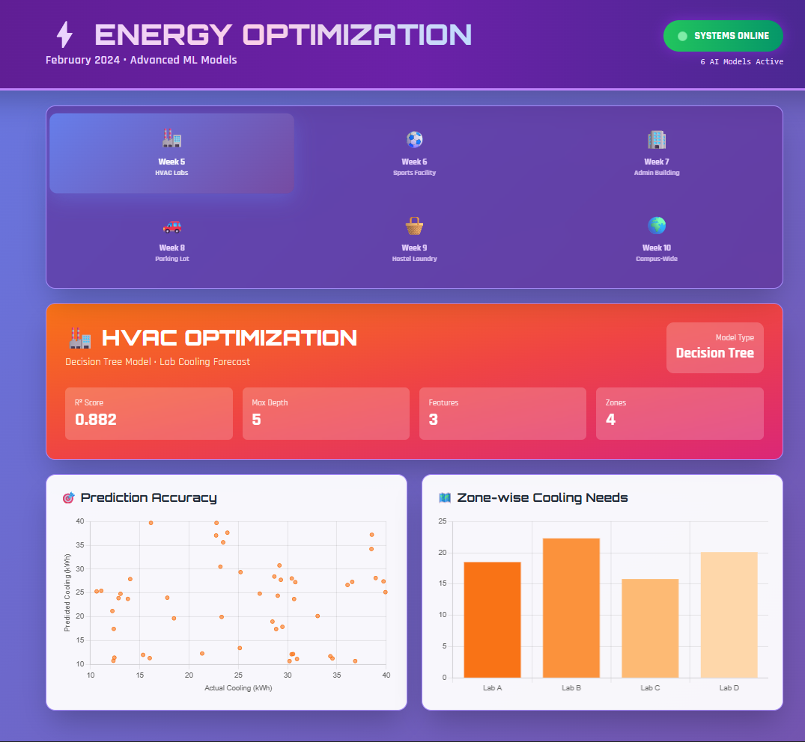
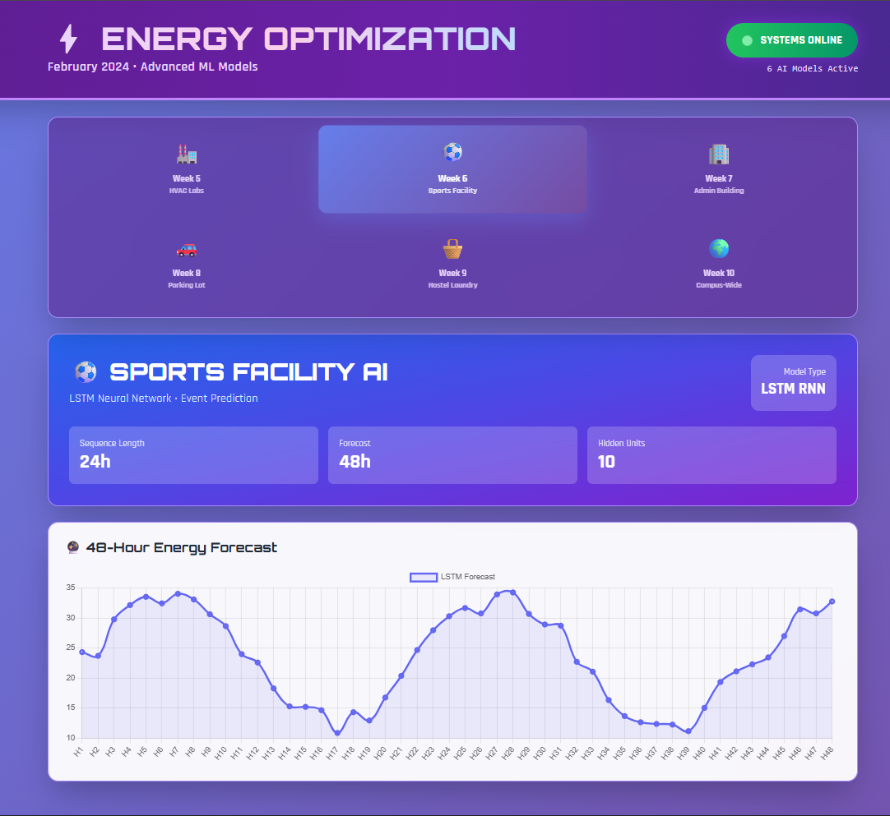
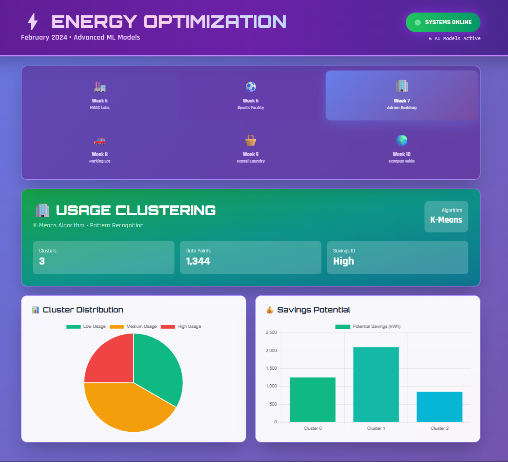
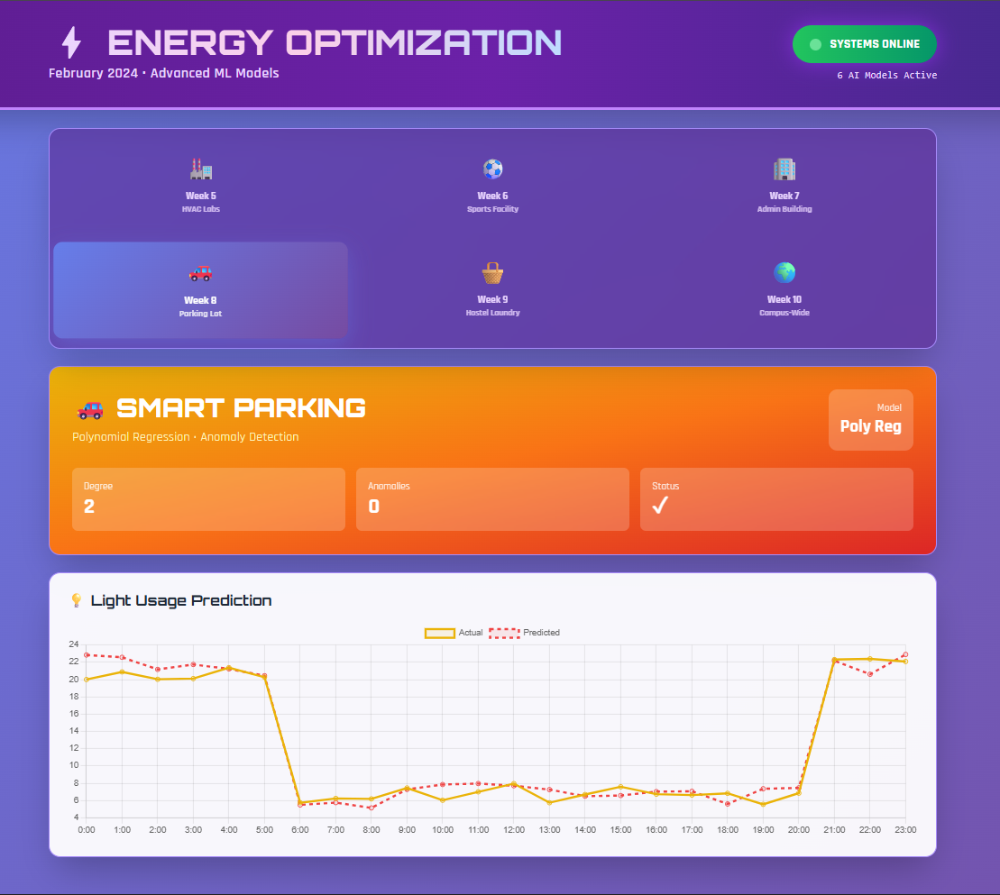
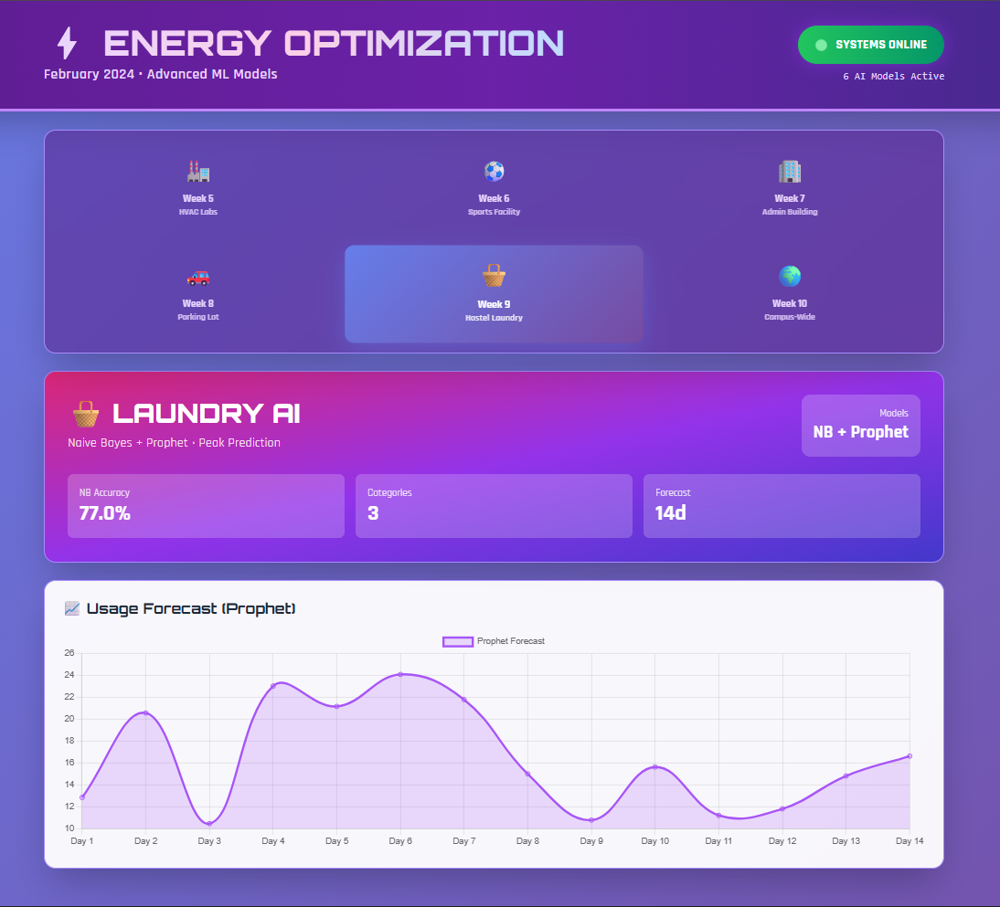
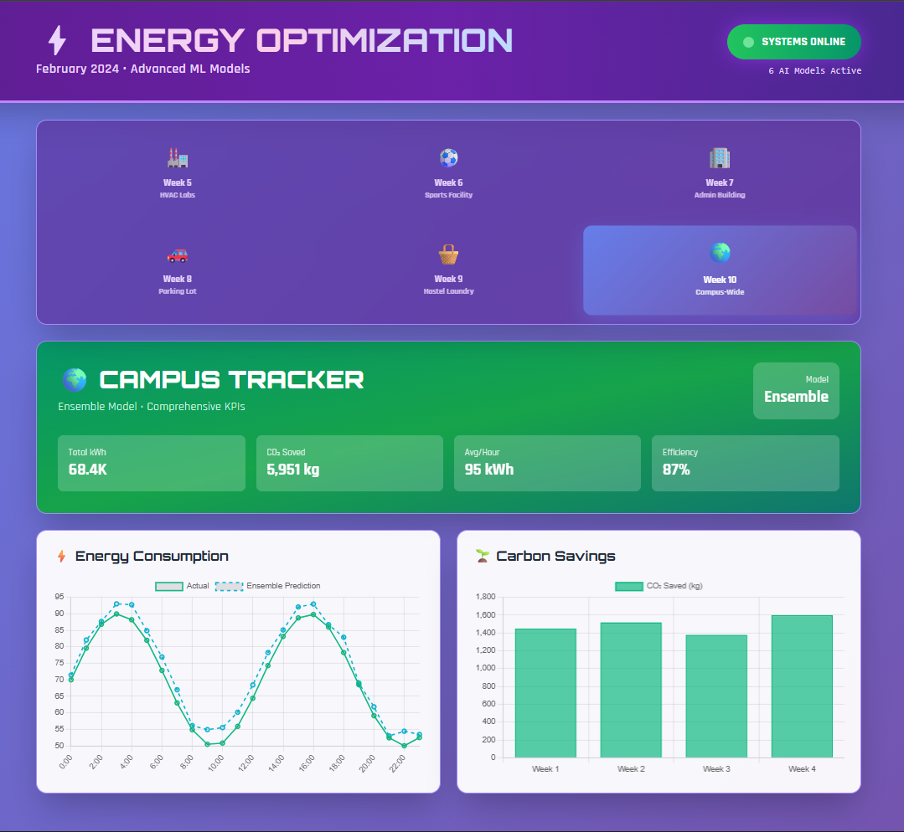

# 🌍 Campus Energy AI

### 🚀 AI-Powered Energy Forecasting & Optimization System

An end-to-end machine learning project that predicts, analyzes, and optimizes electricity usage across a campus using real-world inspired scenarios.

---

## 📌 Overview

This project is divided into two phases:

* 📅 **January – Energy Forecasting**
* ⚡ **February – Energy Optimization**

👉 Together, they form a **complete intelligent energy management system** that:

* Predicts future electricity usage
* Identifies patterns
* Reduces energy waste
* Tracks carbon savings

---

## 📅 Phase 1: Energy Forecasting (January)

### 🏢 Week 1 – Dorm Peak Prediction

* Moving Average + Linear Regression
* Predicts evening electricity spikes (6 PM – 11 PM)
* 📊 R² Score: 0.371

### 🎓 Week 2 – Classroom Forecasting

* ARIMA (2,1,2) Time Series Model
* Predicts next 24-hour energy usage
* Includes confidence intervals

### 📚 Week 3 – Library (Exam Analysis)

* Exponential Smoothing
* Detects increased usage during exams
* 📈 +14.6% energy rise predicted

### 🍽️ Week 4 – Cafeteria (Weather Model)

* Linear Regression with Temperature
* Real-time energy tracking
* 🌡️ Temp Coefficient: 0.648

---

## 🚀 Phase 2: Energy Optimization (February)

### 🏭 Week 5 – HVAC Optimization

* Decision Tree Model
* Optimizes cooling across 4 zones
* 📊 Accuracy: 88%

### ⚽ Week 6 – Sports Facility AI

* LSTM Neural Network
* 48-hour energy prediction
* Learns temporal patterns

### 🏢 Week 7 – Usage Clustering

* K-Means Clustering
* Identifies low, medium, high usage groups
* 💰 High energy-saving potential

### 🚗 Week 8 – Smart Parking

* Polynomial Regression (Degree 2)
* Smart lighting based on vehicle count
* 🚨 Anomaly Detection

### 🧺 Week 9 – Laundry AI

* Naive Bayes (Classification) + Prophet (Forecasting)
* Predicts peak usage
* 📊 Accuracy: 77%

### 🌍 Week 10 – Campus Energy Tracker

* Ensemble Model
* Combines all systems
* ⚡ Total Energy: 68.4K kWh
* 🌱 CO₂ Saved: 5951 kg
* 📈 Efficiency: 87%

---

## 📸 Project Screenshots

### 📅 January – Energy Forecasting

#### 🏢 Week 1 – Dorms

#### 🎓 Week 2 – Classrooms

#### 📚 Week 3 – Library

#### 🍽️ Week 4 – Cafeteria

---

### 🚀 February – Energy Optimization

#### 🏭 Week 5 – HVAC

#### ⚽ Week 6 – Sports

#### 🏢 Week 7 – Clustering

#### 🚗 Week 8 – Parking

#### 🧺 Week 9 – Laundry

#### 🌍 Week 10 – Campus

---

## 🧠 Key Features

* 📊 Interactive dashboards for each module
* 🔮 Time-series forecasting models
* 🤖 Advanced ML algorithms (LSTM, Decision Trees, K-Means)
* 🌡️ Real-time monitoring
* 🌱 Carbon footprint tracking
* ⚡ Energy optimization insights

---

## 🛠️ Tech Stack

* **Languages:** Python
* **Concepts:** Machine Learning, Time Series Analysis
* **Models Used:**

  * Regression Models
  * ARIMA
  * Exponential Smoothing
  * Decision Trees
  * LSTM Neural Networks
  * K-Means Clustering
  * Prophet
* **Visualization:** HTML, CSS, Charts

---

## 🎯 Real-World Impact

This system can be applied to:

* 🏫 Universities
* 🏢 Smart buildings
* 🏙️ Smart cities

👉 Benefits:

* Reduce electricity costs by **20–30%**
* Improve efficiency
* Lower carbon emissions

---

## 👨‍💻 Author

**Vedant Rajekar**
🎓 B.Tech CSE (AI/ML)
📍 Symbiosis Institute of Technology, Nagpur

---

## ⭐ Future Improvements

* Integration with IoT sensors
* Deployment as web app
* Advanced deep learning models
* Mobile dashboard

---

## 💡 Final Note

> This project demonstrates a complete journey from **forecasting → optimization → real-world impact**, making it scalable and production-ready.

---

⭐ If you like this project, give it a star!
